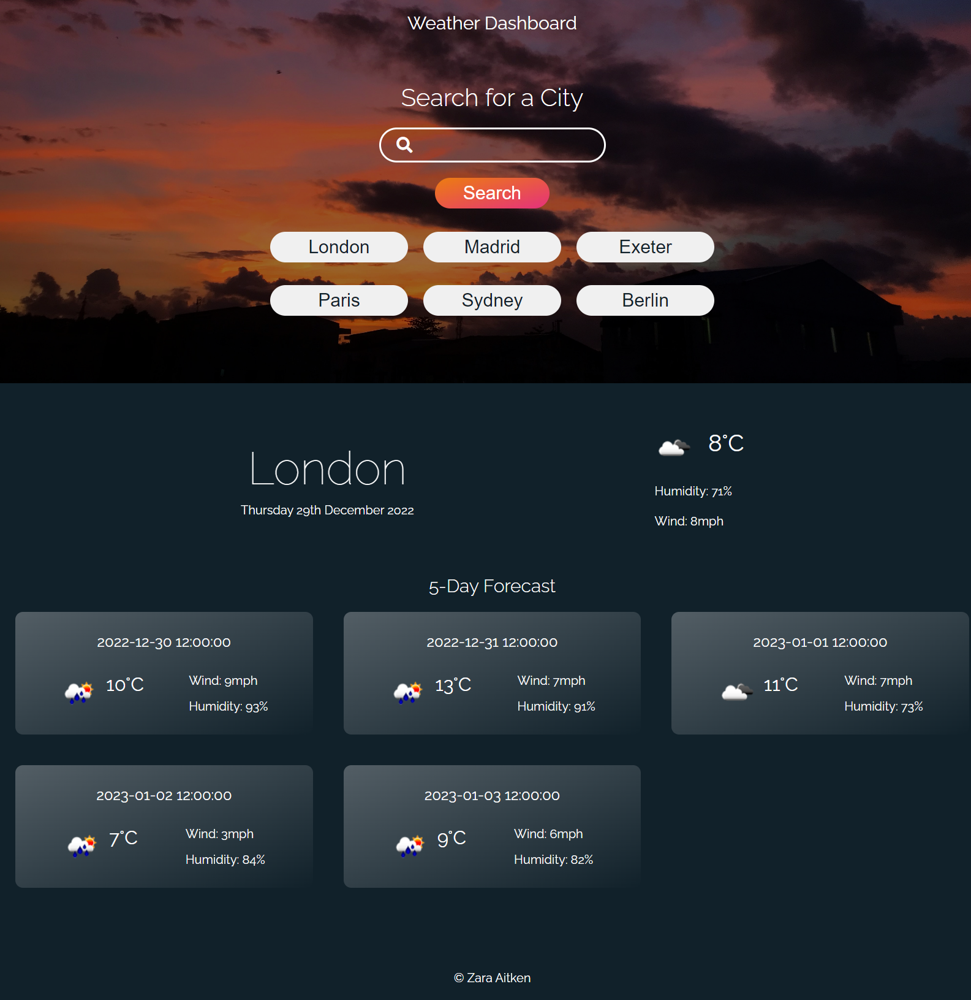

# Weather App

## User Story

```text
AS A traveler
I WANT to see the weather outlook for multiple cities
SO THAT I can plan a trip accordingly
```

## Description

I have created an app that allows users to obtain weather data in the form of a 5-day weather forecast using an API called OpenWeather to retrieve weather data.

This app runs in the browser and features dynamically updated HTML and CSS. I have used the [5 Day Weather Forecast](https://openweathermap.org/forecast5) API to retrieve weather data for cities. I used `localStorage` to store any persistent data.

To retrieve the data, you need to type a place into the search bar and hit the Enter key, or click the 'search' button. You'll then see the location is stored in an additional button below the 'search' button. Each time you enter a new location, the location will be added to localStorage and a new button generated in the search history. A new button will only be generated and the city will only be added to localStorage if it doesn't already exist. Clicking on a button in search history will show you the forecast for that location again.

Once you have entered the location in the search bar, or clicked the search history button, you'll see the current forecast displayed below with the:

* Date
* Current temperature
* City name
* Icon representing the weather conditions
* Humidity
* Wind speed.

Below this, you'll see a five day forecast displaying:

* The date
* An icon representation of weather conditions
* The temperature
* The humidity

## Acceptance Criteria

* Create a weather dashboard with form inputs.
  * When a user searches for a city they are presented with current and future conditions for that city and that city is added to the search history
  * When a user views the current weather conditions for that city they are presented with:
    * The city name
    * The date
    * An icon representation of weather conditions
    * The temperature
    * The humidity
    * The wind speed
  * When a user view future weather conditions for that city they are presented with a 5-day forecast that displays:
    * The date
    * An icon representation of weather conditions
    * The temperature
    * The humidity
  * When a user click on a city in the search history they are again presented with current and future conditions for that city

I have used the following tools to create this application:

* JavaScript
  * Functions
  * If statements
  * For loops
  * For of loops
* JQuery
* HTML
* CSS - I have given the app my own styling in order to practice my CSS and design skills
  * Flexbox
  * Grid
* Dynamically created HTML & CSS
* OpenWeather API


## Screenshot

The following image shows the web application's appearance and functionality:



## Links

Live application: https://zaitken1.github.io/weather-app/

GitHub repository: https://github.com/zaitken1/weather-app


